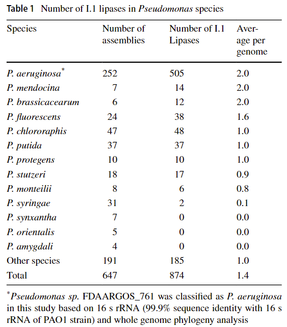

# Evolution-of-Subfamily-I.1-Lipases-in-Pseudomonas-aeruginosa

此分析流程的目的在于重复一篇文章，以熟悉蛋白进化分析的一般流程
[《Evolution of Subfamily I.1 Lipases in Pseudomonas aeruginosa》](https://link.springer.com/article/10.1007/s00284-021-02589-4)

## 1. 数据下载



根据文章Table1提供的数据，从[NCBI](https://www.ncbi.nlm.nih.gov/genome)中选取相应的物种，下载其基因组

### 1.1 基因组数据（实验数据）

```bash
mkdir -p /mnt/d/project/Evolution/genome     #工作路径
```

### 1.2 脂肪酶及其分子伴侣序列数据（目标序列）

```bash
mkdir -p /mnt/d/project/Evolution/lipase
```

## 2. 检索不同假单胞菌中I.1脂肪酶的数量

### 2.1 BLAST工具下载

+ 简介：

BLAST，全称Basic Local Alignment Search Tool，即"基于局部比对算法的搜索工具"，由Altschul等人于1990年发布。BLAST能够实现比较两段核酸或者蛋白序列之间的同源性的功能，它能够快速的找到两段序列之间的同源序列并对比对区域进行打分以确定同源性的高低。

BLAST的运行方式是先用目标序列建数据库（这种数据库称为database，里面的每一条序列称为subject），然后用待查的序列（称为query）在database中搜索，每一条query与database中的每一条subject都要进行双序列比对，从而得出全部比对结果。

BLAST是一个集成的程序包，可以实现五种可能的序列比对方式：

```
blastp：蛋白序列与蛋白库做比对，直接比对蛋白序列的同源性。

blastx：核酸序列对蛋白库的比对，先将核酸序列翻译成蛋白序列（根据相位可以翻译为6种可能的蛋白序列），然后再与蛋白库做比对。

blastn：核酸序列对核酸库的比对，直接比较核酸序列的同源性。

tblastn：蛋白序列对核酸库的比对，将库中的核酸翻译成蛋白序列，然后进行比对。

tblastx：核酸序列对核酸库在蛋白级别的比对，将库和待查序列都翻译成蛋白序列，然后对蛋白序列进行比对。
```
+ 下载
```bash
mkdir -p ~/biosoft #新建文件夹用来存放生信工具

#根据自己的系统，下载blast软件包，这里选用linux的2.12.0版本
wget ftp://ftp.ncbi.nlm.nih.gov/blast/executables/blast+/LATEST/ncbi-blast-2.12.0+-x64-linux.tar.gz
#解压
tar -xzvf ncbi-blast-2.12.0+-x64-linux.tar.gz
#配置环境变量
cd ncbi-blast-2.12.0+
export PATH="$(pwd):$PATH"
#刷新.bashrc文件，使环境变量生效
source ~/.bashrc
#检验是否安装成功
blastp -help
````

## 3. 物种树的构建
### 3.1 MASH工具的下载
+ 简介
Mash发表在2016年6月Genome Biology的上面，它借用MinHash这样一个搜索引擎常用的判断重复文档的技术而实现，另外增加了计算两两之间突变距离和P值显著性检验。Mash通过把大的序列集合简化成小的sketch，从而快速计算它们之间的广义突变距离（global mutation distances，可以近似地理解为『进化距离』，越大表示两者之间亲缘关系越近，如果是0，表示同一物种）。

Mash的原理：首先把两个序列集合打碎成固定长度的短片段，称为k-mer，然后把每个k-mer经哈希函数转换成哈希值，就得到A和B两个由哈希值组成的集合，这样计算A、B两个序列集相似度的问题就转化成A、B两个集合的运算。Jaccard index就是A和B共有元素与A、B总元素之比，如果A和B是两个亲缘关系很远的物种，那么它们相似的序列就少，可以预期Jaccard index会比较小。这里做了一个近似，S(A U B)是集合A U B的一个随机抽样子集，用它代表A U B。


+ 下载
```bash
#利用linuxbrew进行下载
brew install mash
mash --version      #查看版本
mash --help
```
### 3.2 PHYLIP工具的下载

### 3.3 iTOL工具的下载

## 4. 蛋白树的构建


## 5. 共线性分析


## 6. 差异大的同源蛋白构树
### 6.1 CD-Hit工具下载


## 参考

+ [晓金 - Blast](https://www.jianshu.com/p/a912ad4a8dee)
+ [《Mash: fast genome and metagenomedistance estimation using MinHash》](https://genomebiology.biomedcentral.com/articles/10.1186/s13059-016-0997-x#CR9)
+ [popucui - 生信黑板报之Mash](https://zhuanlan.zhihu.com/p/24433778)
