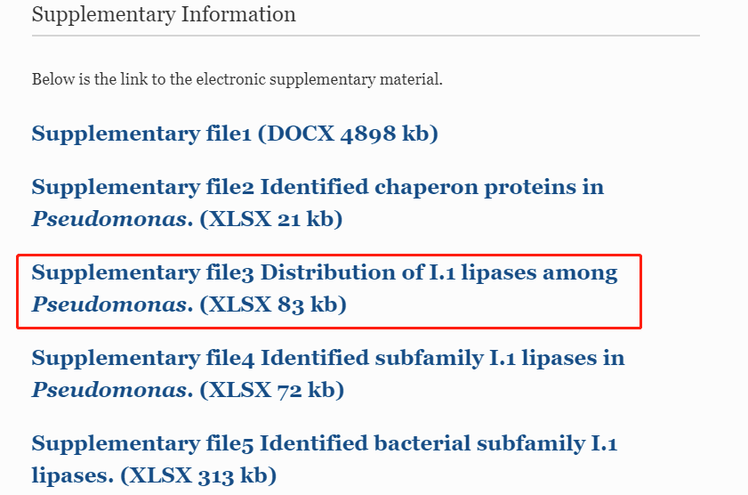
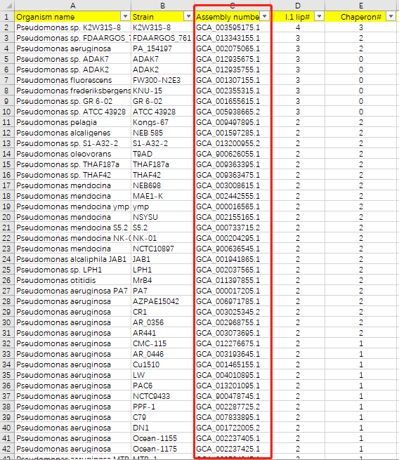
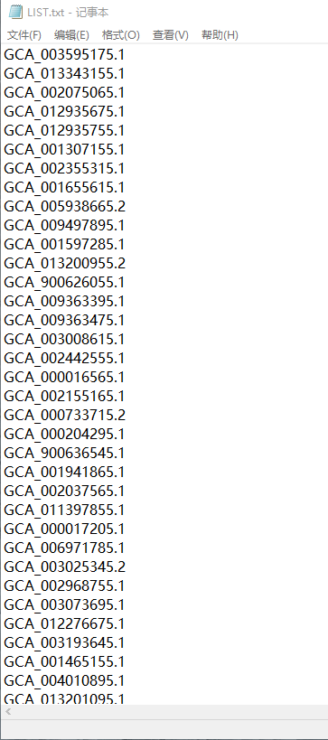
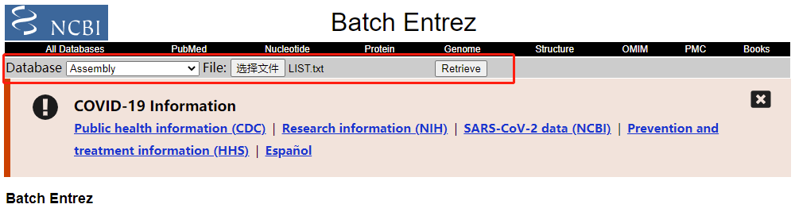
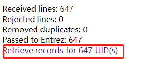
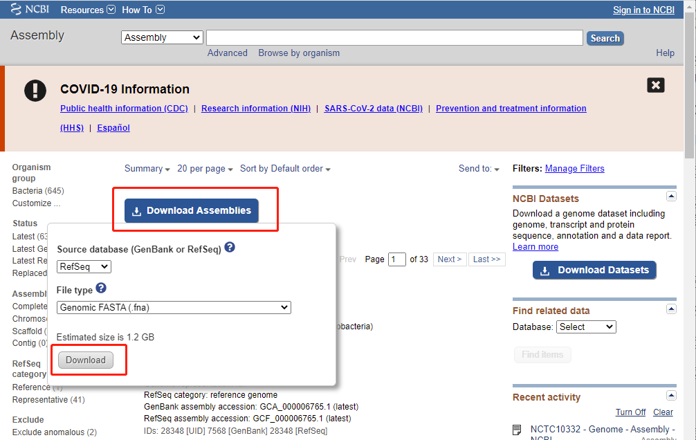
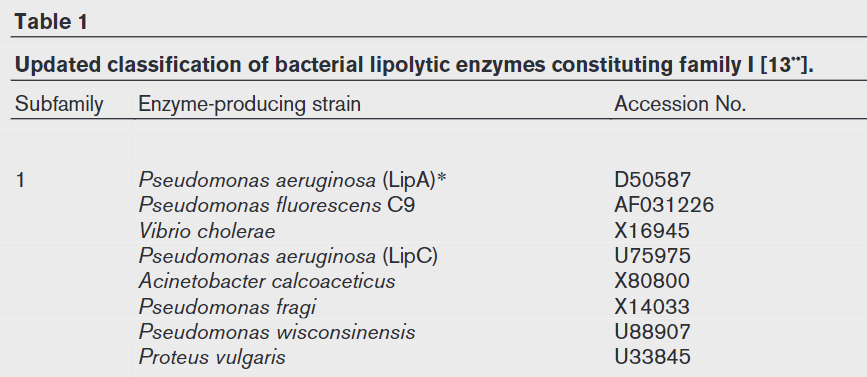
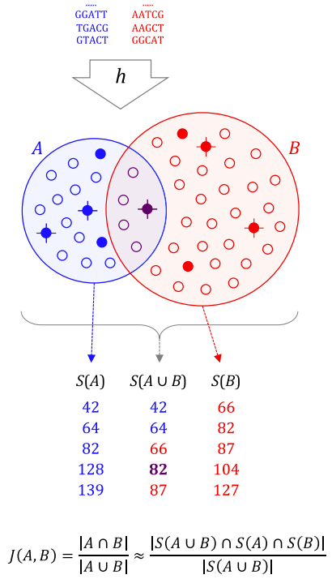
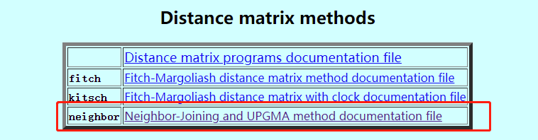
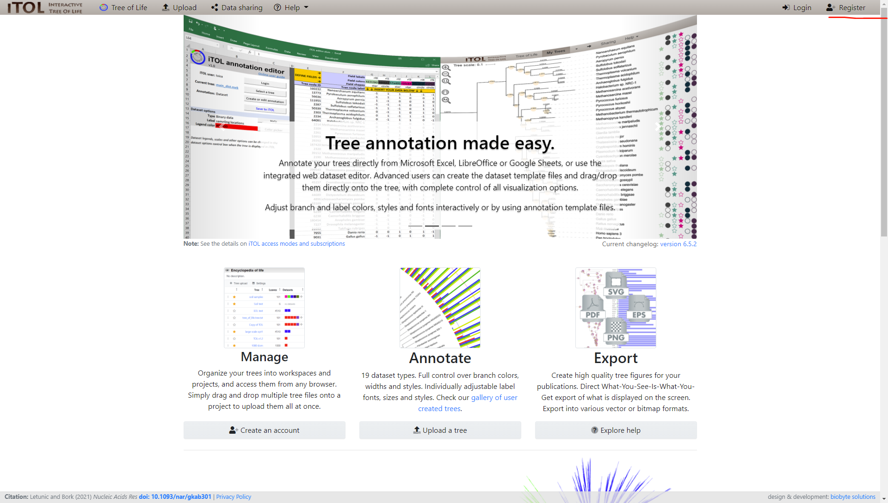

# Evolution of Subfamily I.1 Lipases in *Pseudomonas aeruginosa*

此分析流程的目的在于重复一篇文章，以熟悉蛋白进化分析的一般流程
[《Evolution of Subfamily I.1 Lipases in *Pseudomonas aeruginosa*》](https://link.springer.com/article/10.1007/s00284-021-02589-4)

## 1. 数据下载
### 1.1 基因组数据（实验数据）

+ 根据文章附录提供的数据，从NCBI中选取相应的菌株，下载其基因组数据





+ 建立文件夹用来存放数据
```bash
mkdir -p /mnt/d/project/Evolution/genome

cd /mnt/d/project/Evolution/genome
```
+ 将附录表格中的Assembly number列存入一个txt文件



+ 登录[Batch Entrez网站](https://www.ncbi.nlm.nih.gov/sites/batchentrez),将准备好的登录号文件上传至该网址，点击Retrive



+ 跳转到统计界面，共搜索到647条序列，点击UID



+ 在新跳转出来的界面中点击Download Assemblies,选择下载的格式后下载



>**Refseq与Genbank数据的区别**
>
>Genbank是一个开放的数据库，对每个基因都含有许多序列。很多研究者或者公司都可以自己提交序列，另外这个数据库每天都要和EMBL和DDBJ交换数据。Genbank的数据可能重复或者不准。
>而RefSeq数据库被设计成每个人类位点挑出一个代表序列来减少重复，是NCBI提供的校正的序列数据和相关的信息。数据库包括构建的基因组contig、mRNA、蛋白和整个染色体。refseq序列是NCBI筛选过的非冗余数据库，一般可信度比较高。

+ 将下载下来的文件存入genome文件夹并解压缩,重命名为pa_genomes。根据repote.txt可知，一些序列可能存在问题而被舍弃

### 1.2 I.1脂肪酶及其分子伴侣序列数据（目标序列）

+ 建立文件夹用来存放目标序列

```bash
mkdir -p /mnt/d/project/Evolution/lipase

cd /mnt/d/project/Evolution/lipase
```
+ 根据文章提供的参考文献，获取目标序列的登录号



## 2. 检索不同假单胞菌中I.1脂肪酶的数量

### 2.1 BLAST下载

+ 简介

[BLAST](https://www.ncbi.nlm.nih.gov/books/NBK279690/)，全称Basic Local Alignment Search Tool，即"基于局部比对算法的搜索工具"，由Altschul等人于1990年发布。BLAST能够实现比较两段核酸或者蛋白序列之间的同源性的功能，它能够快速的找到两段序列之间的同源序列并对比对区域进行打分以确定同源性的高低。

BLAST的运行方式是先用目标序列建数据库（这种数据库称为database，里面的每一条序列称为subject），然后用待查的序列（称为query）在database中搜索，每一条query与database中的每一条subject都要进行双序列比对，从而得出全部比对结果。

BLAST是一个集成的程序包，可以实现五种可能的序列比对方式：

```
blastp：蛋白序列与蛋白库做比对，直接比对蛋白序列的同源性。

blastx：核酸序列对蛋白库的比对，先将核酸序列翻译成蛋白序列（根据相位可以翻译为6种可能的蛋白序列），然后再与蛋白库做比对。

blastn：核酸序列对核酸库的比对，直接比较核酸序列的同源性。

tblastn：蛋白序列对核酸库的比对，将库中的核酸翻译成蛋白序列，然后进行比对。

tblastx：核酸序列对核酸库在蛋白级别的比对，将库和待查序列都翻译成蛋白序列，然后对蛋白序列进行比对。
```
+ 下载
```bash
#新建文件夹用来存放生信工具
mkdir -p ~/biosoft 

#根据自己的系统，下载blast软件包，这里选用linux的2.12.0版本
wget ftp://ftp.ncbi.nlm.nih.gov/blast/executables/blast+/LATEST/ncbi-blast-2.12.0+-x64-linux.tar.gz

#解压
tar -xzvf ncbi-blast-2.12.0+-x64-linux.tar.gz

#配置环境变量
cd ncbi-blast-2.12.0+
export PATH="$(pwd):$PATH"

#刷新.bashrc文件，使环境变量生效
source ~/.bashrc

#检验是否安装成功
blastp -help
````

### 2.2 检索
```bash
mkdir -p /mnt/d/project/Evolution/blast
cd /mnt/d/project/Evolution/blast

#将所有的序列合并
gzip -dcf ../genome/pa_genomes/*.fna.gz > ../genome/pa_genomes.fa
cat ../genoma/pa_genomes.fa |
  grep ">" |
  wc -l

#构建数据库
makeblastdb -in ../lipase/target.fa -dbtype nucl -parse_seqids -out ./index
# -in 构建数据库所用的序列文件
# -dbtype 数据库类型，构建的数据库是核苷酸数据库时，dbtype设置为nucl，数据库是氨基酸数据库时，dbtype设置为prot。
# -out 数据库名称
# -parse_seqids 为FASTA输入解析seqid

#blastn检索
blastn -query ../genome/pa_genomes.fa -db ./index -evalue 1e-6 -outfmt 6 -num_threads 6 -out out_file
#-query 进行检索的序列
#-db 使用的数据库
#-evalue 设置输出结果中的e-value阈值。e-value低于1e-5就可认为序列具有较高的同源性
#-outfmt 输出文件的格式，详细见下表
#-num_threads 线程数
#-out 输出文件名称
```
| 数值 | 代表含义 |
| --- | ------------ |
| 0 | pairwise |
| 1 | query-anchored showing identities |
| 2 | query-anchored no identities |
| 3 | flat query-anchored, show identities |
| 4 | flat query-anchored, no identities |
| 5 | query-anchored no identities and blunt ends |
| 6 | flat query-anchored, no identities and blunt ends |
| 7 | XML Blast output |
| 8 | tabular |
| 9 | tabular with comment lines |
| 10 | ASN, text |
| 11 | ASN, binary Integer |

### 2.3 结果分析
```bash
head -n 3 out_file
NC_002516.2     U75975.1_cds_AAC34733.1_1       99.677  930     3       0       5402016 5402945 930     1       0.0     1701
NC_002516.2     D50587.1_cds_BAA09135.1_1       99.466  936     5       0       3214282 3215217 1       936     0.0     1701
NC_002516.2     U88907.1_cds_AAB53646.1_1       76.892  489     99      9       1398678 1399160 61      541     8.51e-7 265
```
第1列：输入序列的名称

第2列：比对到的目标序列名称

第3列：序列相似度

第4列：比对的有效长度

第5列：错配数

第6列：gap数

第7-8列：输入序列比对上的起始和终止位置

第9-10列：比对到目标序列的起始和终止位置

第11列：e-value

第12列：比对得分


## 3. 物种树的构建
### 3.1 MASH下载
+ 简介

[Mash](https://genomebiology.biomedcentral.com/articles/10.1186/s13059-016-0997-x)发表在2016年6月Genome Biology的上面，它借用MinHash这样一个搜索引擎常用的判断重复文档的技术而实现，另外增加了计算两两之间突变距离和P值显著性检验。Mash通过把大的序列集合简化成小的sketch，从而快速计算它们之间的广义突变距离（global mutation distances，可以近似地理解为『进化距离』，越大表示两者之间亲缘关系越近，如果是0，表示同一物种）。

Mash的原理：首先把两个序列集合打碎成固定长度的短片段，称为k-mer，然后把每个k-mer经哈希函数转换成哈希值，就得到A和B两个由哈希值组成的集合，这样计算A、B两个序列集相似度的问题就转化成A、B两个集合的运算。Jaccard index就是A和B共有元素与A、B总元素之比，如果A和B是两个亲缘关系很远的物种，那么它们相似的序列就少，可以预期Jaccard index会比较小。这里做了一个近似，S(AUB)是集合AUB的一个随机抽样子集，用它代表AUB。



+ 下载
```bash
#利用linuxbrew进行下载
brew install mash

mash --help
```
### 3.2 获得距离矩阵
```bash
mkdir /mnt/d/project/Evolution/grouping
cd /mnt/d/project/Evolution/grouping

#make sketch
cat ../genome/pa_genomes.fa |
  mash sketch -k 16 -s 400 -i -p 8 - -o pa_genomes.k16s400.msh

#计算距离

```

### 3.3 PHYLIP下载
+ 简介

[PHYLIP](https://evolution.gs.washington.edu/phylip.html)，即系统发育推理包（the PHYLogeny Inference Package），是用于推断系统发育（进化树）的程序包。它可以通过简约性、兼容性、距离矩阵方法和似然性来推断系统发育。它还可以计算共识树、计算树之间的距离、绘制树、通过自举或折刀重新采样数据集、编辑树以及计算距离矩阵。它可以处理核苷酸序列、蛋白质序列、基因频率、限制性位点、限制性片段、距离、离散字符和连续字符等数据。

主要有以下6个功能：
```
1.DNA和蛋白序列数据的分析软件；

2.序列数据转变为距离数据后，对距离数据分析的软件；

3.对基因频率和连续的元素分析的软件；

4.把序列的每个碱基/氨基酸独立看待时对序列进行分析的软件；

5.按照DOLLO简约型算法对序列进行分析的软件；

6.绘制和修改进化树的软件。
```

+ 下载
```bash
cd ~/biosoft

wget http://evolution.gs.washington.edu/phylip/download/phylip-3.697.tar.gz

tar -zxvf phylip-3.697.tar.gz

cd phylip-3.697/src

cp Makefile.unx Makefile

make install
# 可执行文件位于文件夹exe中，输入“./文件名”即可运行,exe文件夹中的testdata文件夹含有每个应用程序的输入文件格式
```
打开phylip文件夹下的phylip.html可以查看exe文件夹中每个应用的作用

### 3.4 使用PHYLIP中的neighbor绘制发育树


### iTOL美化进化树
+ 进入[iTOL(Interactive Tree of Life)](https://itol.embl.de/)官网并且完成注册



## 4. 蛋白树的构建
### 4.1 MUSCLE下载
+ 简介

[MUSCLE(Multiple Protein Sequence Alignment)](http://www.drive5.com/muscle/)是一款蛋白质水平多序列比对的软件。MUSCLE 先使用渐进式比对(progressive alignment)获得初始的多序列比对，再使用横向精炼(horizontal refinement)迭代提高多序列比对结果。目前muscle 主要用来在基因组进化部分，因为构建进化树和计算选择压力，都需要将序列对齐，muscle因小而快而普遍运用。

+ 下载
```bash
brew install muscle

muscle --help

#使用linuxbrew安装的muscle为v3.8.1551,也可以去官网安装最新的版本
```

## 5. 共线性分析
### 5.1 Easyfig下载
+ 简介

[Easyfig](http://mjsull.github.io/Easyfig/)是一个基因组比较可视化的工具，可以创建多个基因组位点的线性比较图形。

+ 下载
```bash
wget https://github.com/mjsull/Easyfig/releases/download/2.2.2/Easyfig_2.2.2_linux.tar.gz

tar -xzvf Easyfig_2.2.2_linux.tar.gz

cd Easyfig_2.2.2_linux

export PATH="$(pwd):$PATH"

source ~/.bashrc

Easyfig --help      #第一个E要大写
```

## 6. 差异大的同源蛋白构树
### 6.1 CD-HIT下载
+ 简介

[CD-HIT](http://weizhong-lab.ucsd.edu/cd-hit/)是一个非常广泛使用的程序，用于蛋白质或核苷酸序列的聚类和比较。CD-HIT速度非常快，可以处理非常大的数据库。有助于显著减少许多序列分析任务中的计算和手动工作，并有助于理解数据结构和纠正数据集中的偏差。CD-HIT包有CD-HIT、CD-HIT-2D、CD-HIT-EST、CD-HIT-EST-2D、CD-HIT-454、CD-HIT-PARA、PSI-CD-HIT、CD-HIT-OTU、CD-HIT-LAP、CD-HIT-DUP等

CD-HIT是一种贪婪的增量聚类方法，首先对输入的序列根据序列的长短进行排序，并从最长到最短的顺序处理它们。将最长的序列自动的分为第一类并作为第一类的代表序列，然后将剩下的序列与在其之前发现的代表性序列进行比较，根据序列相似性将其归为其中的一类或成为新的一个聚类的代表序列，如此遍历所有序列完成聚类过程。 在默认方式中，序列仅和每一个聚类中的代表性序列（为这类中的最长序列）进行比较而不和这个类中的其他序列进行比对。

CD-HIT主要有有以下功能：
```
CD-HIT（CD-HIT-EST）将相似的蛋白质（dna）聚集成满足用户定义的相似性阈值的簇。

CD-HIT-2D（CD-HIT-EST-2D）比较2个数据集，并确定db2中与阈值以上的db1相似的序列。

CD-HIT-454从焦磷酸测序读取中识别自然和人工复制品。

CD-HIT-OTU将rRNA标签聚集到OTU中

CD-HIT-DUP从单个或成对的Illumina读取中识别重复项

CD-HIT-LAP识别重叠读取
```

+ 下载
```bash
brew install cd-hit

cd-hit --help
```

## 参考

+ [晓金 - Blast](https://www.jianshu.com/p/a912ad4a8dee)
+ [本地使用Blast应用](https://ngs-data-for-pathogen-analysis.readthedocs.io/zh_CN/latest/chapter_02/01_blast.html)
+ [即见君子 - 使用BLAST进行序列比对](https://zhuanlan.zhihu.com/p/107894498)
+ [《Mash: fast genome and metagenomedistance estimation using MinHash》](https://genomebiology.biomedcentral.com/articles/10.1186/s13059-016-0997-x#CR9)
+ [popucui - 生信黑板报之Mash](https://zhuanlan.zhihu.com/p/24433778)
+ [陈连福的生信博客 - PHYLIP](http://www.chenlianfu.com/?p=1857)
+ [即见君子 - 使用iTOL美化进化树](https://zhuanlan.zhihu.com/p/42438544)
+ [oyoli - CD-HIT生信碱基序列去除冗余的方法](https://blog.csdn.net/oyoli/article/details/120784785)
+ [基因学苑 - 生物信息百Jia软件（三）：Muscle](https://www.jianshu.com/p/111dd40cbcec)
+ [萌小芊 - NCBI微生物基因组批量下载](http://www.360doc.com/content/18/0209/21/33459258_729016495.shtml)
+ [NCBI参考序列（Refseq）常见问题回答](https://www.plob.org/article/3460.html)
