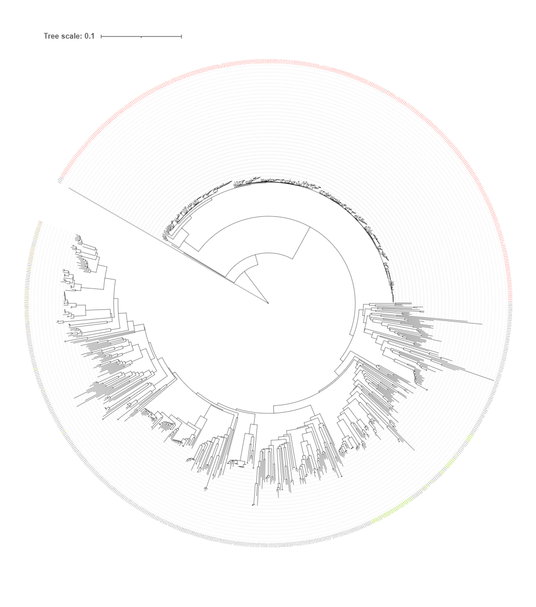

# Evolution of Subfamily I.1 Lipases in *Pseudomonas aeruginosa*

此分析流程的目的在于重复一篇文章，以熟悉蛋白进化分析的一般流程
[《Evolution of Subfamily I.1 Lipases in *Pseudomonas aeruginosa*》](https://link.springer.com/article/10.1007/s00284-021-02589-4)

## 1. 数据下载
### 1.1 基因组数据（实验数据）
+ nwr 下载
```bash
#1. brew安装
brew tap wang-q/tap
brew install nwr

#2. cargo安装
curl https://sh.rustup.rs -sSf | sh
#The cargo, rustc, rustup and other commands will be added toCargo's bin directory, located at:
#/home/shenwei/.cargo/bin

cd /home/shenwei/.cargo/bin
export PATH="$(pwd):$PATH"
source ~/.bashrc

cargo --help
cargo install nwr 

nwr --help

nwr 0.5.3
wang-q <wang-q@outlook.com>
`nwr` is a lightweight tool for newick and taxonomy

USAGE:
    nwr [SUBCOMMAND]

OPTIONS:
    -h, --help       Print help information
    -V, --version    Print version information

SUBCOMMANDS:
    append      Append fields of higher ranks to a TSV file
    download    Download the latest release of `taxdump`
    help        Print this message or the help of the given subcommand(s)
    info        Information of Taxonomy ID(s) or scientific name(s)
    lineage     Output the lineage of the term
    member      List members (of certain ranks) under ancestral term(s)
    restrict    Restrict taxonomy terms to ancestral descendants
    txdb        Init the taxonomy database
```
+ 构建数据库

来源：[wang-q/nwr/doc/assembly.md](https://github.com/wang-q/nwr/blob/master/doc/assembly.md)
```bash
#prepare
brew install wang-q/tap/tsv-utils
brew install sqlite
brew install miller
nwr download
nwr txdb

#download
wget -N -P ~/.nwr https://ftp.ncbi.nlm.nih.gov/genomes/ASSEMBLY_REPORTS/assembly_summary_refseq.txt
wget -N -P ~/.nwr https://ftp.ncbi.nlm.nih.gov/genomes/ASSEMBLY_REPORTS/assembly_summary_genbank.txt

#Sort and filter records
#Sort by assembly_level and seq_rel_date
#Remove incompetent strains
#Transform seq_rel_date to SQLite Date format
for C in refseq genbank; do
    >&2 echo "==> ${C}"
    
    for L in 'Complete Genome' 'Chromosome' 'Scaffold' 'Contig'; do
        cat ~/.nwr/assembly_summary_${C}.txt |
            sed '1d' | #head -n 50 |
            sed '1s/# //' |
            tsv-select -H -f taxid,organism_name,bioproject,assembly_accession,wgs_master,refseq_category,assembly_level,genome_rep,seq_rel_date,asm_name,ftp_path |
            tsv-filter -H --str-eq assembly_level:"${L}" |
            tsv-filter -H --not-iregex organism_name:"\bbacterium\b" |
            tsv-filter -H --not-iregex organism_name:"\buncultured\b" |
            tsv-filter -H --not-iregex organism_name:"\bCandidatus\b" |
            tsv-filter -H --not-iregex organism_name:"\bunidentified\b" |
            tsv-filter -H --not-iregex organism_name:"\bmetagenome\b" |
            tsv-filter -H --not-iregex organism_name:"\barchaeon\b" |
            tsv-filter -H --not-iregex organism_name:"virus\b" |
            tsv-filter -H --not-iregex organism_name:"phage\b" |
            keep-header -- tsv-sort -k9,9 |
            perl -nla -F"\t" -e '$F[8] =~ s/\//-/g; print join qq{\t}, @F' | # Date
            sed '1s/^/#/' |
            tsv-filter -H --invert --str-eq assembly_level:Scaffold --str-eq genome_rep:Partial |
            tsv-filter -H --invert --str-eq assembly_level:Contig --str-eq genome_rep:Partial |
            nwr append stdin -r species -r genus --id;
    done |
    tsv-uniq \
    > ~/.nwr/ar_${C}.tsv

done

#creat databases
# DDL
for C in refseq genbank; do
    sqlite3 ~/.nwr/ar_${C}.sqlite <<EOF
PRAGMA journal_mode = OFF;
PRAGMA synchronous = 0;
PRAGMA cache_size = 1000000;
PRAGMA locking_mode = EXCLUSIVE;
PRAGMA temp_store = MEMORY;
DROP TABLE IF EXISTS ar;

CREATE TABLE IF NOT EXISTS ar (
    tax_id             INTEGER,
    organism_name      VARCHAR (50),
    bioproject         VARCHAR (50),
    assembly_accession VARCHAR (50),
    wgs_master         VARCHAR (50),
    refseq_category    VARCHAR (50),
    assembly_level     VARCHAR (50),
    genome_rep         VARCHAR (50),
    seq_rel_date       DATE,
    asm_name           VARCHAR (255),
    ftp_path           VARCHAR (255),
    species            VARCHAR (50),
    species_id         INTEGER,
    genus              VARCHAR (50),
    genus_id           INTEGER
);

CREATE INDEX idx_ar_tax_id ON ar(tax_id);
CREATE INDEX idx_ar_organism_name ON ar(organism_name);
CREATE INDEX idx_ar_species_id ON ar(species_id);
CREATE INDEX idx_ar_genus_id ON ar(genus_id);

EOF
done

# import
# sqlite .import doesn't accept relative paths
pushd ~/.nwr/

sqlite3 -tabs ar_refseq.sqlite <<EOF
PRAGMA journal_mode = OFF;
.import --skip 1 ar_refseq.tsv ar

EOF

sqlite3 -tabs ar_genbank.sqlite <<EOF
PRAGMA journal_mode = OFF;
.import --skip 1 ar_genbank.tsv ar

EOF

popd
```

+ 利用数据库检索假单胞菌菌株
```bash
mkdir -p /mnt/d/project/Evolution/genome
cd /mnt/d/project/Evolution/genome

#构建假单胞菌属菌株列表
echo "
    SELECT
        organism_name || ' ' || assembly_accession AS name,
        species, genus, ftp_path, assembly_level
    FROM ar
    WHERE 1=1
        AND genus IN ('Pseudomonas')
        AND species NOT LIKE '% sp.%'
        AND organism_name NOT LIKE '% sp.%'
        AND assembly_level IN ('Complete Genome', 'Chromosome')
    " |
    sqlite3 -tabs ~/.nwr/ar_refseq.sqlite |
    tsv-filter --invert --str-eq 2:"Pseudomonas aeruginosa" --str-eq 5:"Chromosome" \
    > raw.tsv

#构建outgroups列表
GENUS=$(
    nwr member Bacteria -r genus |
        grep -v -i "Candidatus " |
        grep -v -i "candidate " |
        sed '1d' |
        cut -f 1 |
        tr "\n" "," |
        sed 's/,$/\)/' |
        sed 's/^/\(/'
)

echo "
.headers ON

    SELECT
        *
    FROM ar
    WHERE 1=1
        AND genus_id IN $GENUS
        AND refseq_category IN ('reference genome')
    " |
    sqlite3 -tabs ~/.nwr/ar_refseq.sqlite \
    > reference.tsv

#根据文献内容，只保留Bacillus subtilis subsp. subtilis str. 168作为外群
cat reference.tsv | 
tsv-filter -H --eq tax_id:224308 > reference_pass.tsv 

#合并假单胞菌和外群
cat reference_pass.tsv |
    tsv-select -H -f organism_name,species,genus,ftp_path,assembly_level \
    >> raw.tsv

cat raw.tsv |
    grep -v '^#' |
    tsv-uniq |
    perl ~/Scripts/withncbi/taxon/abbr_name.pl -c "1,2,3" -s '\t' -m 3 --shortsub |
    (echo -e '#name\tftp_path\torganism\tassembly_level' && cat ) |
    perl -nl -a -F"," -e '
        BEGIN{my %seen};
        /^#/ and print and next;
        /^organism_name/i and next;
        $seen{$F[5]}++;
        $seen{$F[5]} > 1 and next;
        printf qq{%s\t%s\t%s\t%s\n}, $F[5], $F[3], $F[1], $F[4];
        ' |
    keep-header -- sort -k3,3 -k1,1 \
    > Pseudomonas.assembly.tsv  #重新命名

#去除重复
cat Pseudomonas.assembly.tsv |
    tsv-uniq -f 1 --repeated
```
+ 下载
```bash
perl ~/Scripts/withncbi/taxon/assembly_prep.pl \
    -f ./Pseudomonas.assembly.tsv \
    -o ASSEMBLY
    
# Remove dirs not in the list
find ASSEMBLY -maxdepth 1 -mindepth 1 -type d |
    tr "/" "\t" |
    cut -f 2 |
    tsv-join --exclude -k 1 -f ASSEMBLY/rsync.tsv -d 1 |
    parallel --no-run-if-empty --linebuffer -k -j 1 '
        echo Remove {}
        rm -fr ASSEMBLY/{}
    '
    
bash ASSEMBLY/Pseudomonas.assembly.rsync.sh
bash ASSEMBLY/Pseudomonas.assembly.collect.sh

#检验是否下载完全 md5
cat ASSEMBLY/rsync.tsv |
    tsv-select -f 1 |
    parallel -j 4 --keep-order '
        echo "==> {}"
        cd ASSEMBLY/{}
        md5sum --check md5checksums.txt
    ' |
    grep -v ": OK"
```
## 2. 物种树的构建
### 2.1 MASH下载
+ 简介

[Mash](https://genomebiology.biomedcentral.com/articles/10.1186/s13059-016-0997-x)发表在2016年6月Genome Biology的上面，它借用MinHash这样一个搜索引擎常用的判断重复文档的技术而实现，另外增加了计算两两之间突变距离和P值显著性检验。Mash通过把大的序列集合简化成小的sketch，从而快速计算它们之间的广义突变距离（global mutation distances，可以近似地理解为『进化距离』，越大表示两者之间亲缘关系越近，如果是0，表示同一物种）。

Mash的原理：首先把两个序列集合打碎成固定长度的短片段，称为k-mer，然后把每个k-mer经哈希函数转换成哈希值，就得到A和B两个由哈希值组成的集合，这样计算A、B两个序列集相似度的问题就转化成A、B两个集合的运算。Jaccard index就是A和B共有元素与A、B总元素之比，如果A和B是两个亲缘关系很远的物种，那么它们相似的序列就少，可以预期Jaccard index会比较小。这里做了一个近似，S(AUB)是集合AUB的一个随机抽样子集，用它代表AUB。


+ 下载
```bash
#利用linuxbrew进行下载
brew install mash

mash --help
```
### 2.2 获得距离矩阵
```bash
cd genome
#将所有的序列合并
find ../genome/ASSEMBLY -maxdepth 2 -name "*_genomic.fna.gz" |
   grep -v "_from_" |
   xargs gzip -dcf > genome.fa
cat genome.fa | wc -l  #存在一些质粒的序列，大于实际菌株数量
cat genome.fa | grep ">" | grep -v "plasmid" > raw.lst
cat raw.lst | grep -v "NZ_CCSF01000001.1" |
    grep -v "NZ_CP044085.1" | grep -v "NZ_CP077094.1" > strains_raw.lst 
#NZ_CCSF01000001.1序列名称太长，影响后续phylip建树,NZ_CP044085.1(Pseudomonas luteola)与NZ_CP077094.1（Pseudomonas promysalinigenes）相对于其余株系基因距离太远
cat strains_raw.lst | cut -d " " -f 1 | cut -d ">" -f 2 > strains.lst
faops some genome.fa strains.lst genome_pass.fa

mkdir /mnt/d/project/Evolution/grouping
cd /mnt/d/project/Evolution/grouping

#make sketch
cat ../genome/genome_pass.fa |
  mash sketch -k 16 -s 400 -i -p 8 - -o pa_genomes.k16s400.msh

#计算距离
mash dist -t  -p 6 pa_genomes.k16s400.msh pa_genomes.k16s400.msh > dist.txt
```

### 2.3 PHYLIP下载
+ 简介

[PHYLIP](https://evolution.gs.washington.edu/phylip.html)，即系统发育推理包（the PHYLogeny Inference Package），是用于推断系统发育（进化树）的程序包。它可以通过简约性、兼容性、距离矩阵方法和似然性来推断系统发育。它还可以计算共识树、计算树之间的距离、绘制树、通过自举或折刀重新采样数据集、编辑树以及计算距离矩阵。它可以处理核苷酸序列、蛋白质序列、基因频率、限制性位点、限制性片段、距离、离散字符和连续字符等数据。

主要有以下6个功能：
```
1.DNA和蛋白序列数据的分析软件；

2.序列数据转变为距离数据后，对距离数据分析的软件；

3.对基因频率和连续的元素分析的软件；

4.把序列的每个碱基/氨基酸独立看待时对序列进行分析的软件；

5.按照DOLLO简约型算法对序列进行分析的软件；

6.绘制和修改进化树的软件。
```

+ 下载
```bash
cd ~/biosoft

wget http://evolution.gs.washington.edu/phylip/download/phylip-3.697.tar.gz

tar -zxvf phylip-3.697.tar.gz

cd phylip-3.697/src

cp Makefile.unx Makefile

make install
# 可执行文件位于文件夹exe中，输入“./文件名”即可运行,exe文件夹中的testdata文件夹含有每个应用程序的输入文件格式
```
打开phylip文件夹下的phylip.html可以查看exe文件夹中每个应用的作用

### 2.4 使用PHYLIP中的neighbor绘制发育树


+ PHYLIP格式说明
```
    7
Bovine      0.0000  1.6866  1.7198  1.6606  1.5243  1.6043  1.5905
Mouse       1.6866  0.0000  1.5232  1.4841  1.4465  1.4389  1.4629
Gibbon      1.7198  1.5232  0.0000  0.7115  0.5958  0.6179  0.5583
Orang       1.6606  1.4841  0.7115  0.0000  0.4631  0.5061  0.4710
Gorilla     1.5243  1.4465  0.5958  0.4631  0.0000  0.3484  0.3083
Chimp       1.6043  1.4389  0.6179  0.5061  0.3484  0.0000  0.2692
Human       1.5905  1.4629  0.5583  0.4710  0.3083  0.2692  0.0000
#第一行说明序列的个数，并且每个序列的名称不能超过10个字符
```
+ 更改mash dist -t 输出文件格式
```bash
#删去第一行
cat dist.txt | sed -e "1d" > dist2.txt

#利用perl的脚本（ten.pl）修改序列名称，删去序列名称小数点后面的数字（版本号）以及NZ后的下划线
perl ../script/ten.pl

#将序列数量添加到第一行
sed "1 i$(cat dist2.txt | wc -l)" -i format.txt
```
+ 利用neighbor计算发育树
```bash
cd ~/biosoft/phylip-3.697/exe
cp /mnt/d/project/Evolution/grouping/format.txt ~/biosoft/phylip-3.697/exe

./neighbor
#neighbor: can't find input file "infile"
#Please enter a new file name>format.txt  #输入文件名

ls
DrawGram.jar      contml    dnamlk    dolpenny  font2       gendist         neighbor  promlk    seqboot
DrawGramJava.unx  contrast  dnamove   drawgram  font3       kitsch          outfile   protdist  test.txt
DrawTree.jar      dnacomp   dnapars   drawtree  font4       libdrawgram.so  outtree   protpars  treedist
DrawTreeJava.unx  dnadist   dnapenny  factor    font5       libdrawtree.so  pars      restdist
clique            dnainvar  dollop    fitch     font6       mix             penny     restml
consense          dnaml     dolmove   font1     format.txt  move            proml     retree
#这里多了一个outfile和一个outtree输出文件

sed -i s/_//g ./outtree #phylip在一些序列名称后面添加了下划线
#将这两个文件存放到grouping文件夹方便查看
cp outtree outfile /mnt/d/project/Evolution/grouping
```

### 2.5 iTOL美化进化树
+ 进入[iTOL(Interactive Tree of Life)](https://itol.embl.de/)官网并且完成注册


+ 导入上文的outtree文件


+ 点击outtree打开并完善发育树


+ 为不同物种的label上色（铜绿假单胞菌红色，丁香假单胞菌棕色，恶臭假单胞菌绿色），阅读iTOL的HELP文件了解


```bash
mkdir /mnt/d/project/Evolution/iTOL
cd /mnt/d/project/Evolution/iTOL
cp ../genome/strains_raw.lst ./

perl ../script/name.pl #修改序列名称，使其和进化树label一致
cat name.lst | grep "Pseudomonas aeruginosa" > Pseudomonas_aeruginosa.lst #铜绿假单胞菌
cat name.lst | grep "Pseudomonas syringae" > Pseudomonas_syringae.lst #丁香假单胞菌
cat name.lst | grep "Pseudomonas putida" > Pseudomonas_putida.lst #恶臭假单胞菌

PSA=$(cat Pseudomonas_aeruginosa.lst | cut -d " " -f 1 | cut -d ">" -f 2)
#echo $PSA
PSS=$(cat Pseudomonas_syringae.lst | cut -d " " -f 1 | cut -d ">" -f 2)
PSP=$(cat Pseudomonas_putida.lst | cut -d " " -f 1 | cut -d ">" -f 2)

echo -e "TREE_COLORS\nSEPARATOR SPACE\nDATA" > label.txt
for A in $PSA; do
    echo -e "$A label #f44336" >> label.txt
done
for S in $PSS; do 
    echo -e "$S label #7f6000" >> label.txt
done
for P in $PSP; do 
    echo -e "$P label #8fce00" >> label.txt
done
```
将label.txt文件拖动到进化树上或者在构建进化树的时候上传label.txt文件，即可对进化树进行修饰




## 3. 检索不同假单胞菌中I.1脂肪酶的数量
### 3.1 BLAST下载

+ 简介

[BLAST](https://www.ncbi.nlm.nih.gov/books/NBK279690/)，全称Basic Local Alignment Search Tool，即"基于局部比对算法的搜索工具"，由Altschul等人于1990年发布。BLAST能够实现比较两段核酸或者蛋白序列之间的同源性的功能，它能够快速的找到两段序列之间的同源序列并对比对区域进行打分以确定同源性的高低。

BLAST的运行方式是先用目标序列建数据库（这种数据库称为database，里面的每一条序列称为subject），然后用待查的序列（称为query）在database中搜索，每一条query与database中的每一条subject都要进行双序列比对，从而得出全部比对结果。

BLAST是一个集成的程序包，可以实现五种可能的序列比对方式：

```
blastp：蛋白序列与蛋白库做比对，直接比对蛋白序列的同源性。

blastx：核酸序列对蛋白库的比对，先将核酸序列翻译成蛋白序列（根据相位可以翻译为6种可能的蛋白序列），然后再与蛋白库做比对。

blastn：核酸序列对核酸库的比对，直接比较核酸序列的同源性。

tblastn：蛋白序列对核酸库的比对，将库中的核酸翻译成蛋白序列，然后进行比对。

tblastx：核酸序列对核酸库在蛋白级别的比对，将库和待查序列都翻译成蛋白序列，然后对蛋白序列进行比对。
```
+ 下载
```bash
#新建文件夹用来存放生信工具
mkdir -p ~/biosoft 

#根据自己的系统，下载blast软件包，这里选用linux的2.12.0版本
wget ftp://ftp.ncbi.nlm.nih.gov/blast/executables/blast+/LATEST/ncbi-blast-2.12.0+-x64-linux.tar.gz

#解压
tar -xzvf ncbi-blast-2.12.0+-x64-linux.tar.gz

#配置环境变量
cd ncbi-blast-2.12.0+
export PATH="$(pwd):$PATH"

#刷新.bashrc文件，使环境变量生效
source ~/.bashrc

#检验是否安装成功
blastp -help
````
>**faa文件简介**
>
>.faa = FASTA Amino Acid file 全部蛋白序列文件，每条序列的第一行是由>开头的任意文字说明。用于序列标记，最好每条序列的标识具有唯一性，一般会用空格把头信息分为两个部分：第一部分是序列名字，它和大于号（>）紧接在一起；第二部分是注释信息，这个可以没有。从第二行开始为序列本身，只允许使用既定的核苷酸或氨基酸编码符号，其中核苷酸大小写均可，氨基酸只能大写。
>
>    序列名称                   蛋白名称                       物种名称
>
>\>YP_004994269.1 hypothetical protein BDGL_000001 \[Acinetobacter pittii PHEA-2]
MDDVDPITGTAEPGSTVTVTFPDGSTITTTAEGDGTWSVANPGTLVTGDVVTATATDPAGNTSLPVTSIVPVFIDAIDDI
ATVLSEVNPVVTHPDIPGGALVTFPSLSLIGPIIDLKDQTPITVTVPEGGIASFDVSFGGVLIGGGIGSYDLNILRYNEN
TGGYELYSKIDNAGIMVGFIGGVMGGGASISNLPEGQYALVLTPGEGVQVTGIGVANISVTNEVLSDYGDVVAKGNVITA
NNPENPTDVADVIHAGETATVISVANEDGVTTALPQDSEAFTRIQGEYGELFIDKNGNYEYIRDFTIPNSLGKVDSFTYT
IQDSDGHQDTATLNVRIDTNDLDITWPEDPTQDGVVELTATDNTAAAAITLVPSTNTTVDTGSMAASSTKPLFGAATSVA
GSDTSDVINVAANTAASLNFSVTTQGGILDSSANGDTFSYQVQKLVNGVWTTQPGASASVVHSSPILGDAGGTVLISGSY
QVSASDTASQWRVVFGSTESNIPLIAGTNTTTVNTTVNATFTHYDQFVGNGATVTATGNLLTDDSGNGVDVTGGASTKVF
VETSPGTYVQANGQTITVEDGTFVVSANGTYTFTANSSATSGDVATLNYKLVAATGDESTPATLTVNIGSETISTASHDI
ITTGAGADTVVYNLLNAADATGGNGKDEWTDFNLAQGDKVDISSLLNGANASNISNYVTVTSDGAGNTLISIDRDGTGNT
YNSTDLIVLKNTDTTLDELLNNNQLLF

### 3.2 检索
```bash
mkdir -p /mnt/d/project/Evolution/blast
cd /mnt/d/project/Evolution/blast
cp ../genome/genome_pass.fa ./

#构建数据库
makeblastdb -in ./lipase.fa -dbtype nucl -parse_seqids -out ./index
# -in 构建数据库所用的序列文件
# -dbtype 数据库类型，构建的数据库是核苷酸数据库时，dbtype设置为nucl，数据库是氨基酸数据库时，dbtype设置为prot。
# -out 数据库名称
# -parse_seqids 为FASTA输入解析seqid

#blastn检索
blastn -query ../genome/genome_pass.fa -db ./index -qcov_hsp_perc 60 -perc_identity 35 -outfmt 6 -out out_file
#-query 进行检索的序列
#-db 使用的数据库
#-qcov_hsp_perc Percent query coverage per hsp
#-perc_identity Percent identity
#-outfmt 输出文件的格式，详细见下表
#-out 输出文件名称
```
| 数值 | 代表含义 |
| --- | ------------ |
| 0 | pairwise |
| 1 | query-anchored showing identities |
| 2 | query-anchored no identities |
| 3 | flat query-anchored, show identities |
| 4 | flat query-anchored, no identities |
| 5 | query-anchored no identities and blunt ends |
| 6 | flat query-anchored, no identities and blunt ends |
| 7 | XML Blast output |
| 8 | tabular |
| 9 | tabular with comment lines |
| 10 | ASN, text |
| 11 | ASN, binary Integer |

### 3.3 结果分析
```bash
head -n 3 out_file
lcl|AF031226.1_gene_1   CP027477.1      96.742  890     27      2       1       889     662634  663522 0.0      1482
lcl|AF031226.1_gene_1   CP038207.1      92.705  891     65      0       1       891     1204976 12058660.0      1286
lcl|AF031226.1_gene_1   CP038438.1      92.881  885     62      1       1       884     663883  664767 0.0      1284
```
第1列：输入序列的名称

第2列：比对到的目标序列名称

第3列：序列相似度

第4列：比对的有效长度

第5列：错配数

第6列：gap数

第7-8列：输入序列比对上的起始和终止位置

第9-10列：比对到目标序列的起始和终止位置

第11列：e-value

第12列：比对得分

+ 统计

因为我们关心的是每个菌株中I.1脂肪酶的数量，即上文结论中输入序列比对到的次数，这里需要进行统计
```
#提取第一列
cat out_file |
  cut -f 2 > statistic.txt

#利用perl的脚本（script文件夹中）进行统计
perl statistics.pl

head -n 5 RESULT.txt
AE004091.2      2
AE016853.1      1
AP012280.1      2
AP013070.1      1
AP014522.1      1
AP014622.1      2
```

## 4. 蛋白树的构建
### 4.1 MUSCLE下载
+ 简介

[MUSCLE(MUltiply Sequence Comparision by Log-Exceptation)](http://www.drive5.com/muscle/)是一款蛋白质水平多序列比对的软件。MUSCLE 先使用渐进式比对(progressive alignment)获得初始的多序列比对，再使用横向精炼(horizontal refinement)迭代提高多序列比对结果。目前muscle 主要用来在基因组进化部分，因为构建进化树和计算选择压力，都需要将序列对齐，muscle因小而快而普遍运用。

+ 下载
```bash
brew install muscle

muscle --help

#用法：muscle -in seqs.fa -out seqs.afa
```
### 4.2 提取每个菌株中识别到的序列
+ 利用faops region提取序列
```
#用法
faops region [options] <in.fa> <region.txt> <out.fa>
options:
    -s         add strand '(+)' to headers
    -l INT     sequence line length [80]

<region.txt> is a text file containing one field
    seq_name:begin-end[,begin-end]

in.fa  == stdin  means reading from stdin
out.fa == stdout means writing to stdout
```

+ 根据blast结果构建region.txt文件
```bash
mkdir /mnt/d/project/Evolution/protine
cd /mnt/d/project/Evolution/protine

cp ../blast/out_file ./
perl region.pl  #script文件夹
```
+ 提取
```bash
faops region ../genome/pa_genomes.fa region.txt protine.fa
```

### 4.3 MUSCLE对比分析
```bash
muscle -in protine.fa -out protine.afa
#-in <inputfile>    Input file in FASTA format (default stdin)
#-out <outputfile>  Output alignment in FASTA format (default stdout)
```

### 4.4 IQ-Tree下载
+ 简介

[IQ-TREE](http://www.iqtree.org/doc/)是一款基于最大拟然法（ML）的建树软件，具有准确、快速、灵活等特点，简化了参数设置，可以帮助用户选择最佳的进化模型，特别适用于大数据的系统发育分析。

+ 下载
```bash
brew install iqtree

iqtree --help
```
>**几种系统发育推断的算法比较**
>
>UPGMA法:UPGMA代表未加权对组方法和算术平均数。这是发展系统进化树的最快技术。由此产生的系统发生树是一个有共同祖先的有根系统发生树。当使用UPGMA方法绘制系统发生树时，它认为所有谱系的进化速率都是一样的，而不考虑突变率。
>
>邻接法（neighbor joining）:该方法通过确定距离最近(或相邻)的成对分类单位来使系统树的总距离达到最小，相邻是指两个分类单位在某一无根分叉树中仅通过一个节点(node)相连。通过循序地将相邻点合并成新的点，就可以建立一个相应的拓扑树。
>
>最大简约法（maximum parsimony）:这个原则认为：解释一个过程的最好理论是所需假设数目最少的那一个。对所有可能的拓扑结构进行计算，并计算出所需替代数最小的那个拓扑结构，作为最优树。如果在进化时间范围内碱基变更的量较小，则简约法是很合理的（插入、缺失），但对于存在大量变更的情形，随着所用资料的增加，简约法可能给出实际上更为错误的系统树。
>
>最大拟然法（maximum likelihood）:选取一个特定的替代模型来分析给定的一组序列数据，使得获得的每一个拓扑结构的似然率都为最大值，然后再挑出其中似然率最大的拓扑结构作为最优树。在最大似然法的分析中，所考虑的参数并不是拓扑结构而是每个拓扑结构的枝长，并对似然率球最大值来估计枝长。

### 4.5 使用IQ-TREE建树
```bash
#使用ModelFinder寻找最佳模型
iqtree -s protine.afa -m MF -nt 2
#-s <alignment>       Input alignment in PHYLIP/FASTA/NEXUS/CLUSTAL/MSF format
#-m MF                Extended model selection with FreeRate heterogeneity
#-nt <num_threads>    Number of cores/threads or AUTO for automatic detection
Akaike Information Criterion:           GTR+F+R6
Corrected Akaike Information Criterion: TIM3+F+R6
Bayesian Information Criterion:         TIM3+F+G4
Best-fit model: TIM3+F+G4 chosen according to BIC #这里显示了最佳的模型

#建树
mkdir tree
cd tree
cp ../protine.afa ./

iqtree -s protine.afa -m TIM3+F+G4 -bb 1000 -nt AUTO
#-bb <#replicates>    Ultrafast bootstrap (>=1000)
```
### 4.6 iTOL美化进化树
+ 参考3.5的内容导入进化树

### 4.7 SignalP下载（预测信号肽）
+ 简介

信号肽是蛋白质N-末端一段编码长度为5-30的疏水性氨基酸序列，用于引导新合成蛋白质向通路转移的短肽链。信号肽存在于分泌蛋白、跨膜蛋白和真核生物细胞器内的蛋白中。

信号肽指引蛋白质转移的方式有两种：（1）常规的分泌（Sec/secretory）通路；（2）双精氨酸转移（Tat/twin-arginine）通路。前者存在于原核生物蛋白质转移到质膜过程中，以及真核生物蛋白质转移到内质网膜的过程中。后者存在于细菌、古菌、叶绿体和线粒体中，信号肽序列较长、疏水性较弱且尾部区含有两个连续精氨酸。

信号肽指引蛋白质转运后，将由信号肽酶进行切除。信号肽酶有三种：（1）一型信号肽酶（SPaseI）；（2）二型信号肽酶（SPaseII）；（3）三型信号肽酶（SPaseIII）。大部分信号肽由SPaseI进行移除，SPaseI存在古菌、细菌和真核生物中；细菌和古菌脂蛋白的信号肽C端含有一段称为 lipobox 的保守区域，由SPaseII切除其信号肽；细菌的四型菌毛蛋白信号肽由SPaseIII进行切除。此外：分泌通路（Sec）相关信号肽能由SPaseI、SPaseII和SPaseIII切除，但是双精氨酸转移（Tat）通路相关信号肽仅由 SPaseI和SPaseII切除。

使用SignalP 5.0能对原核生物的信号肽Sec/SPI、Sec/SPII和Tat/SPI，和对真核生物仅含有 Sec/SPI信号肽进行预测。

+ 下载
```bash

```
### 4.8 PfamScan下载（寻找同源基因家族）
+ 简介

+ 下载
```bash

```

## 5. 基因岛分析
基因组岛（英语：Genomic island，GI）是指一个基因组中，有证据显示可能来源于基因水平转移的一段。这一术语通常用于描述微生物，特别是细菌的基因组。GI中的基因可以编码多种功能的蛋白质，可以参与细菌共生或病理过程，并且可以帮助微生物适应环境。
### 5.1 使用IslandViewer分析和下载假单胞菌基因岛
+ 从NCBI上下载PAO1的GeneBank数据，序列太大的话要勾选customize view中的show seqquence选项


+ 进入[IsLandViwer 4的Genome Upload](https://www.pathogenomics.sfu.ca/islandviewer/upload/)界面，提交序列的GeneBank数据。


+结果分析


### Easyfig下载
+ 简介

[Easyfig](http://mjsull.github.io/Easyfig/)是一个基因组比较可视化的工具，可以创建多个基因组位点的线性比较图形。

+ 下载
```bash
wget https://github.com/mjsull/Easyfig/releases/download/2.2.2/Easyfig_2.2.2_linux.tar.gz

tar -xzvf Easyfig_2.2.2_linux.tar.gz

cd Easyfig_2.2.2_linux

export PATH="$(pwd):$PATH"

source ~/.bashrc

Easyfig --help      #第一个E要大写
```

## 6. 差异大的同源蛋白构树
### 6.1 CD-HIT下载
+ 简介

[CD-HIT](http://weizhong-lab.ucsd.edu/cd-hit/)是一个非常广泛使用的程序，用于蛋白质或核苷酸序列的聚类和比较。CD-HIT速度非常快，可以处理非常大的数据库。有助于显著减少许多序列分析任务中的计算和手动工作，并有助于理解数据结构和纠正数据集中的偏差。CD-HIT包有CD-HIT、CD-HIT-2D、CD-HIT-EST、CD-HIT-EST-2D、CD-HIT-454、CD-HIT-PARA、PSI-CD-HIT、CD-HIT-OTU、CD-HIT-LAP、CD-HIT-DUP等

CD-HIT是一种贪婪的增量聚类方法，首先对输入的序列根据序列的长短进行排序，并从最长到最短的顺序处理它们。将最长的序列自动的分为第一类并作为第一类的代表序列，然后将剩下的序列与在其之前发现的代表性序列进行比较，根据序列相似性将其归为其中的一类或成为新的一个聚类的代表序列，如此遍历所有序列完成聚类过程。 在默认方式中，序列仅和每一个聚类中的代表性序列（为这类中的最长序列）进行比较而不和这个类中的其他序列进行比对。

CD-HIT主要有有以下功能：
```
CD-HIT（CD-HIT-EST）将相似的蛋白质（dna）聚集成满足用户定义的相似性阈值的簇。

CD-HIT-2D（CD-HIT-EST-2D）比较2个数据集，并确定db2中与阈值以上的db1相似的序列。

CD-HIT-454从焦磷酸测序读取中识别自然和人工复制品。

CD-HIT-OTU将rRNA标签聚集到OTU中

CD-HIT-DUP从单个或成对的Illumina读取中识别重复项

CD-HIT-LAP识别重叠读取
```

+ 下载
```bash
brew install cd-hit

cd-hit --help
```

## 参考

+ [晓金 - Blast](https://www.jianshu.com/p/a912ad4a8dee)
+ [本地使用Blast应用](https://ngs-data-for-pathogen-analysis.readthedocs.io/zh_CN/latest/chapter_02/01_blast.html)
+ [即见君子 - 使用BLAST进行序列比对](https://zhuanlan.zhihu.com/p/107894498)
+ [《Mash: fast genome and metagenomedistance estimation using MinHash》](https://genomebiology.biomedcentral.com/articles/10.1186/s13059-016-0997-x#CR9)
+ [popucui - 生信黑板报之Mash](https://zhuanlan.zhihu.com/p/24433778)
+ [陈连福的生信博客 - PHYLIP](http://www.chenlianfu.com/?p=1857)
+ [即见君子 - 使用iTOL美化进化树](https://zhuanlan.zhihu.com/p/42438544)
+ [oyoli - CD-HIT生信碱基序列去除冗余的方法](https://blog.csdn.net/oyoli/article/details/120784785)
+ [基因学苑 - 生物信息百Jia软件（三）：Muscle](https://www.jianshu.com/p/111dd40cbcec)
+ [萌小芊 - NCBI微生物基因组批量下载](http://www.360doc.com/content/18/0209/21/33459258_729016495.shtml)
+ [NCBI参考序列（Refseq）常见问题回答](https://www.plob.org/article/3460.html)
+ [《MUSCLE: multiple sequence alignment with high accuracy and high throughput》](https://academic.oup.com/nar/article/32/5/1792/2380623)
+ [IQ-TREE 2: New Models and Efficient Methods for Phylogenetic Inference in the Genomic Era](https://academic.oup.com/mbe/article/37/5/1530/5721363)
+ [iqtree2：新模型高效构建系统发育树](https://zhuanlan.zhihu.com/p/164473497)
+ [使用IQ-TREE构建系统进化树](https://www.jianshu.com/p/f830282866cd)
+ [使用SignalP对蛋白序列进行信号肽预测](http://www.chenlianfu.com/?p=2746)
+ [NCBI上基因组文件格式及解释](https://www.jianshu.com/p/2e3c9b8de625)
